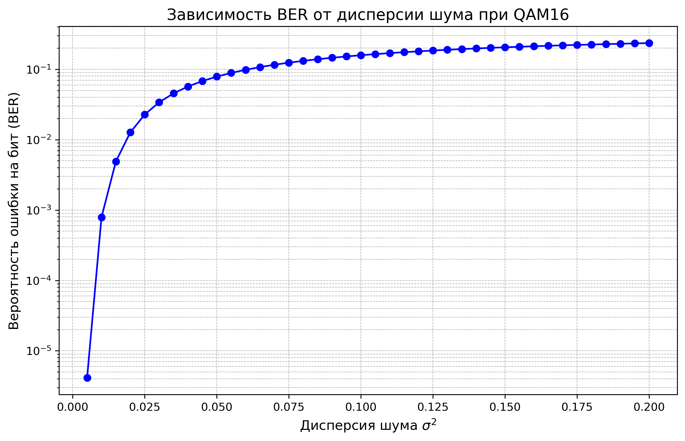

# QAM16 Modulation with AWGN Noise and BER Calculation

Этот проект реализует модулятор и демодулятор для QAM16 с добавлением гауссовского шума (AWGN) к созвездию QAM16 и вычислением вероятности ошибки на бит (BER).

## Структура проекта

Проект состоит из двух файлов:
- **main.cpp** — реализация модуляции и демодуляции на C++.
- **plot.py** — Python-скрипт для построения графика.

## Классы (main.cpp)

main.cpp содержит несколько классов:
- **QAM16Modulator** — для модуляции бинарной последовательности в символы QAM16.
- **QAM16Demodulator** — для демодуляции символов QAM16 в бинарную последовательность.
- **AWGN** — для добавления гауссовского шума к модулированным данным.
- **BitGenerator** — для генерации случайной последовательности бит.

## Параметры (main.cpp)

- **num_bits** (int) — количество бит в случайной последовательности.
- **start_variance** (double) — начальное значение дисперсии.
- **end_variance** (double) — конечное значение дисперсии.
- **step_size** (double) — шаг изменения дисперсии.

Пользователь может установить параметры при запуске программы.

## Использование

1. Скомпилируйте и запустите проект на C++:
    ```bash
    g++ main.cpp -o qam16
    ./qam16
    ```
2. После этого в файл `ber.csv` будут сохранены данные для построения графика.
3. Для построения графика используйте Python-скрипт `plot.py`:
    ```bash
    python3 plot.py
    ```

## График

На графике показана зависимость вероятности ошибки на бит от дисперсии шума. Для графика ниже использовались следующие настройки:
- **num_bits = 100000000**
- **start_variance = 0.005**
- **end_variance = 0.2**
- **step_size = 0.005**



## Лицензия

Лицензировано на условиях лицензии MIT. См. файл LICENSE.