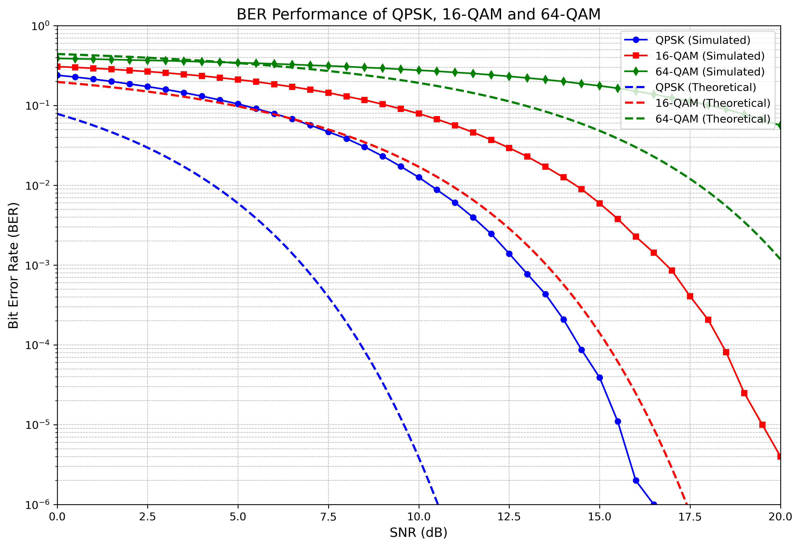

# QAM16 Modulation with AWGN Noise and BER Calculation

Этот проект реализует систему модуляции/демодуляции с добавлением гауссовского шума и расчетом вероятности битовой ошибки (BER).

## Структура проекта

Проект состоит из двух файлов:
- **main.cpp** — реализация модуляции и демодуляции на C++.
- **plot.py** — Python-скрипт для построения графика.

## Классы (main.cpp)

main.cpp содержит несколько классов:
- **QAMModulator** — для модуляции бинарной последовательности в символы QAM.
- **QAMDemodulator** — для демодуляции символов QAM в бинарную последовательность.
- **AWGN** — для добавления гауссовского шума к модулированным данным.
- **BitGenerator** — для генерации случайной последовательности бит.

## Параметры (main.cpp)

- **modulation_type** (int) - тип модуляции (QPSK, QAM16, QAM64).
- **num_bits** (int) — количество бит в случайной последовательности.
- **start_snr_db** (double) — начальное значение SNR.
- **end_snr_db** (double) — конечное значение SNR.
- **snr_step_db** (double) — шаг изменения SRN.

Пользователь может установить параметры при запуске программы.

## Использование

1. Скомпилируйте и запустите проект на C++:
    ```bash
    g++ main.cpp -o qam
    ./qam16
    ```
2. После этого в файл `x_ber.csv` будут сохранены данные для построения графика, где x - выбранный тип.
3. Для построения графика используйте Python-скрипт `plot.py`:
    ```bash
    python3 plot.py
    ```

## График

На графике показаны зависимости вероятности ошибки на бит от SNR. Для графика ниже использовались следующие настройки:
- **num_bits = 1000000**
- **start_snr_db = 0**
- **end_snr_db = 20**
- **snr_step_db = 0.5**



## Лицензия

Лицензировано на условиях лицензии MIT. См. файл LICENSE.